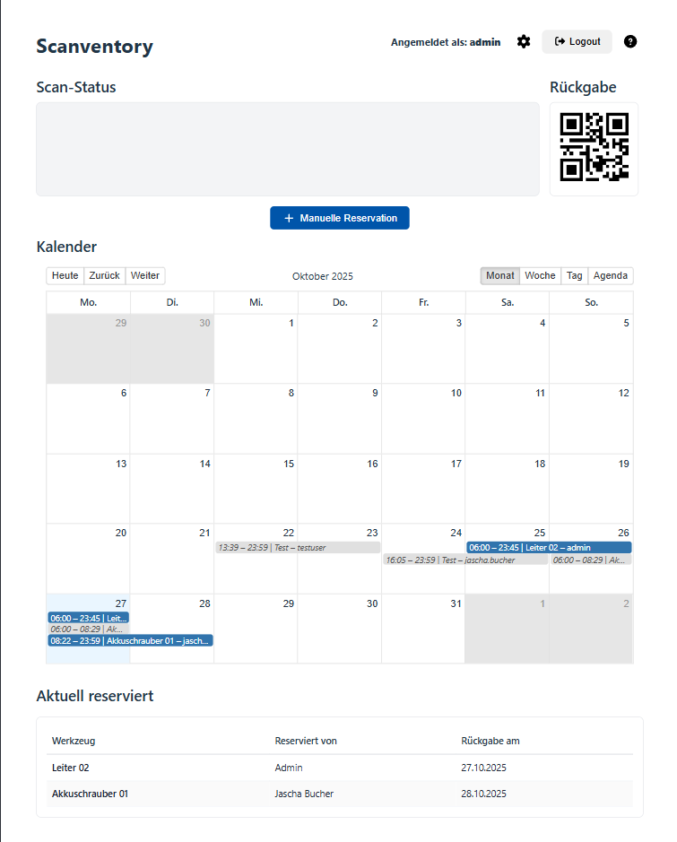
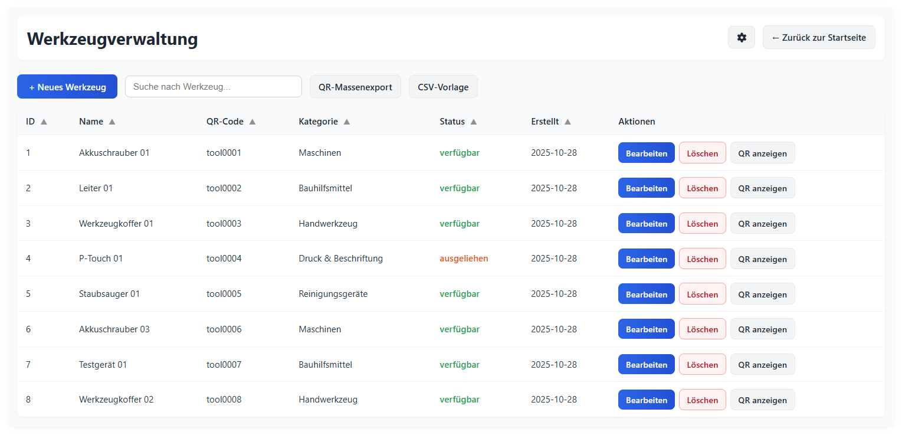
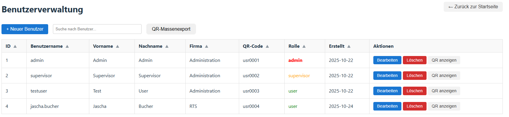
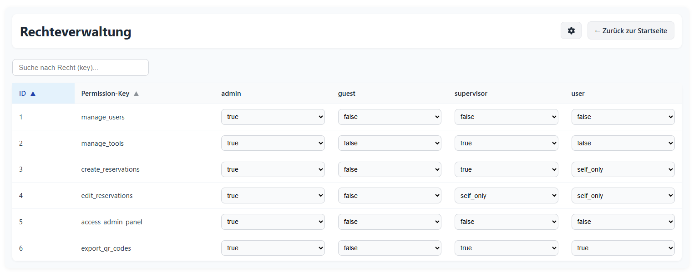
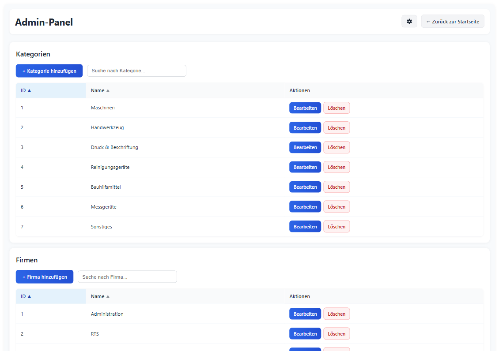
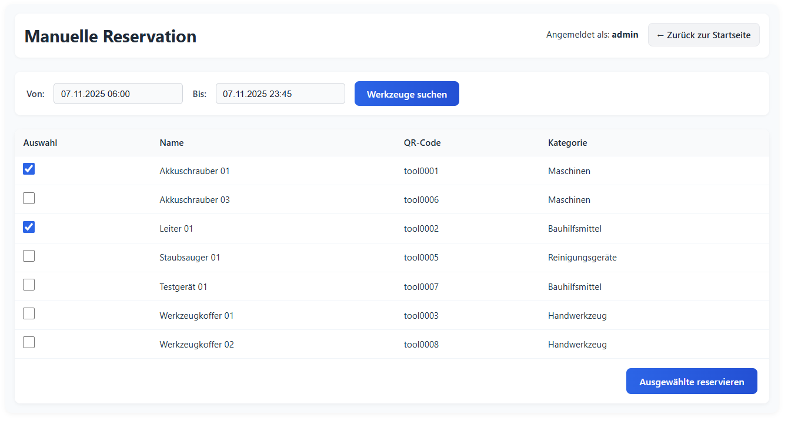

# 📦 Scanventory – Werkzeugreservierung per QR-Code

**Scanventory** ist eine lokal gehostete Webanwendung zur Verwaltung und Ausleihe von Werkzeugen mittels QR-Codes. Sie basiert auf einem **React-Frontend** und einem **Flask-Backend** mit SQLite-Datenbank und ist optimiert für den Einsatz auf Geräten wie dem Raspberry Pi.

---

## 🔍 Projektüberblick

- Offlinefähig, lokal nutzbar (z. B. Raspberry Pi)
- Bedienung per HID-Scanner (Tastaturemulation)
- QR-Code-System für Benutzer, Werkzeuge & Funktionen
- Rollenbasiertes Berechtigungssystem (`admin`, `supervisor`, `user`, `guest`)
- Kalender- und Listenansicht für alle Reservationen
- Adminbereich zur Verwaltung von Benutzern, Werkzeugen & Rechten
- Unterstützung für CSV-Import & QR-Export (PNG/ZIP)
- Unterstützung für manuelle & gescannte Reservationen

---

## 🧱 Projektstruktur

```
scanventory_v2/
├── backend/
│   ├── __pycache__/
│   ├── instance/
│   ├── routes/
│   ├── scheduler/
│   ├── utils/
│   ├── venv/
│   ├── .env
│   ├── app.py
│   ├── models.py
│   ├── requirements.txt
│   └── setup.py
├── frontend/
│   ├── node_modules/
│   ├── public/
│   ├── src/
│   │   ├── components/
│   │   ├── pages/
│   │   ├── styles/
│   │   ├── utils/
│   │   ├── App.css
│   │   ├── App.jsx
│   │   ├── index.css
│   │   └── main.jsx
│   ├── .env
│   ├── index.html
│   ├── package.json
│   ├── package-lock.json
│   ├── vite.config.js
│   └── .gitignore
└── README.md
```

---

## ⚙️ Technologien

| Bereich     | Technologie              |
| ----------- | ------------------------ |
| Frontend    | React + Vite, CSS-Module |
| Backend     | Flask, SQLAlchemy        |
| Auth        | JWT, bcrypt              |
| Datenbank   | SQLite                   |
| QR-Codes    | qrcode, Pillow           |
| Zeitplanung | APScheduler              |

---

## 🖥️ Installation (lokal, z. B. in VS Code)

### 🔹 Voraussetzungen

- Python 3.10+
- Node.js + npm
- Git

### 🔹 Backend einrichten

```bash
git clone https://github.com/outcastoasis/scanventory_v2.git
cd scanventory_v2/backend
python -m venv venv
source venv/bin/activate  # Windows: venv\Scripts\activate
pip install -r requirements.txt
```

.env-Datei erstellen:

```ini
# backend/.env
SECRET_KEY=admin1234

ADMIN_USERNAME=admin
ADMIN_PASSWORD=admin123
ADMIN_QR=usr0001

SUPERVISOR_USERNAME=supervisor
SUPERVISOR_PASSWORD=supervisor123
SUPERVISOR_QR=usr0002

TESTUSER_USERNAME=testuser
TESTUSER_PASSWORD=testuser123
TESTUSER_QR=usr0003
```

Backend starten:

```bash
python app.py
```

### 🔹 Frontend einrichten

```bash
cd ../frontend
npm install
npm run dev
```

`.env` Datei:

```ini
# frontend/.env
VITE_API_URL=http://localhost:5050
# VITE_API_URL=http://server-scanventory (wenn auf RPI installiert -> Hostname von Server-RPI)
```

Frontend erreichbar unter: [http://localhost:5173](http://localhost:5173)

---

## 🍓 Installation auf Raspberry Pi

- Raspberry Pi OS (Bookworm) mit Lite Version

### 1. Pakete installieren

```bash
sudo apt update && sudo apt upgrade -y
sudo apt install git python3 python3-pip python3-venv nginx nodejs npm sqlite3 -y
```

### 2. Projekt klonen

```bash
cd /opt
sudo git clone https://github.com/outcastoasis/scanventory_v2.git
sudo chown -R $USER:$USER scanventory_v2
```

### 3. Backend vorbereiten

```bash
cd scanventory_v2/backend
python3 -m venv venv && source venv/bin/activate
pip install -r requirements.txt
```

### 4. Datenbank initialisieren

```bash
export FLASK_APP=app
flask db init
flask db migrate -m "Initial schema"
flask db upgrade
```

### 5. Benutzer initialisieren

`.env` Datei wie oben beschrieben im `backend/` Ordner anlegen, dann:

```bash
python3 app.py
```

### 6. Gunicorn Service einrichten

```bash
sudo nano /etc/systemd/system/scanventory.service
```

**Inhalt:**

```
[Unit]
Description=Scanventory Gunicorn
After=network.target

[Service]
User=pi
WorkingDirectory=/opt/scanventory_v2/backend
ExecStart=/opt/scanventory_v2/backend/venv/bin/gunicorn -w 4 -b 127.0.0.1:8000 app:app
Restart=always

[Install]
WantedBy=multi-user.target
```

Service starten:

```bash
sudo systemctl daemon-reload && sudo systemctl enable --now scanventory
```

### 7. Frontend vorbereiten

```ini
# Datei: frontend/.env
VITE_API_URL=http://server-scanventory
```

```bash
cd ../frontend
npm install
npm run build
```

### 8. Nginx konfigurieren

```bash
sudo nano /etc/nginx/sites-available/scanventory
```

**Inhalt:**

```
server {
    listen 80;
    server_name server-scanventory;

    root /opt/scanventory_v2/frontend/dist;
    index index.html;

    location /api {
        proxy_pass http://127.0.0.1:8000/api;
        proxy_set_header Host $host;
        proxy_set_header X-Real-IP $remote_addr;
        proxy_set_header X-Forwarded-For $proxy_add_x_forwarded_for;
    }

    location / {
        try_files $uri /index.html;
    }
}
```

```bash
sudo ln -s /etc/nginx/sites-available/scanventory /etc/nginx/sites-enabled/
sudo nginx -t && sudo systemctl restart nginx
```

---

## 📸 Screenshots








---

## 📅 Hauptfunktionen (Auszug)

- Werkzeugausleihe über QR-Codes (usr + tool + dur)
- Rückgabe über QR-Code "return"
- Übersicht aller Reservationen im Kalender (öffentlich)
- Adminpanel für Benutzer/Werkzeug/Rechte
- Rollen- und Rechteverwaltung über die Datenbank
- Login-System mit Token (JWT)
- Filterbare Listen & QR-Export
- Automatische Rückgaben per Scheduler

---

## 💡 Weitere Ideen & geplante Features

- [x] CSV-Import für Benutzer und Werkzeuge
- Fehler-Log-Anzeige im Adminpanel
- [x] Responsive Redesign für mobile Geräte
- Notizen für reservationen fixen -> werden aktuell nicht gespeichert -> Muss in Datenbank erweitert werden
- create_reservations Rechte in manuelle reservation einbauen, damit auch Admins oder Supervisor für andere User reservieren können.
- "Last Login" Datum bei Profilen einfügen und speichern für Kontrolle auf inaktive Konten.
- [x] Admin Buttons abhängig von Rollen machen (sichtbarkeit der Adminpages je nach berechtigungen des eingeloggten Users)
- Reservationen bearbeiten wenn möglich mit "isediting" versehen. Dass popup bei anderen dann ebenfalls für bearbeitung geblockt ist
- alle User können alle Rückgaben tätigen (momentan wenn user eingeloggt nur die eigenen)
- [x] Fehler abfangen, wenn User gelöscht wird mit aktuellen Reservationen -> Fehlermeldung, um 90 Tage zu warten (damit alle Reservationen gelöscht sind danach)

---

## 📄 Lizenz

MIT – freie Nutzung für Bildung & interne Zwecke.
