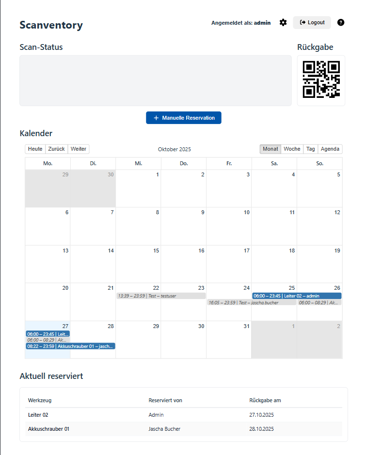
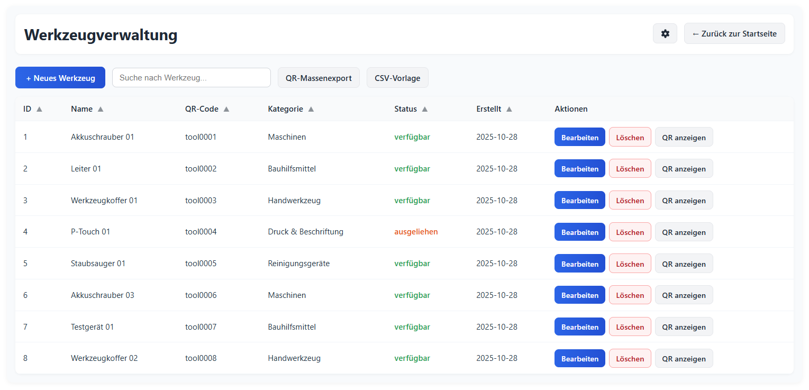
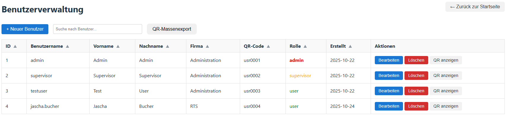
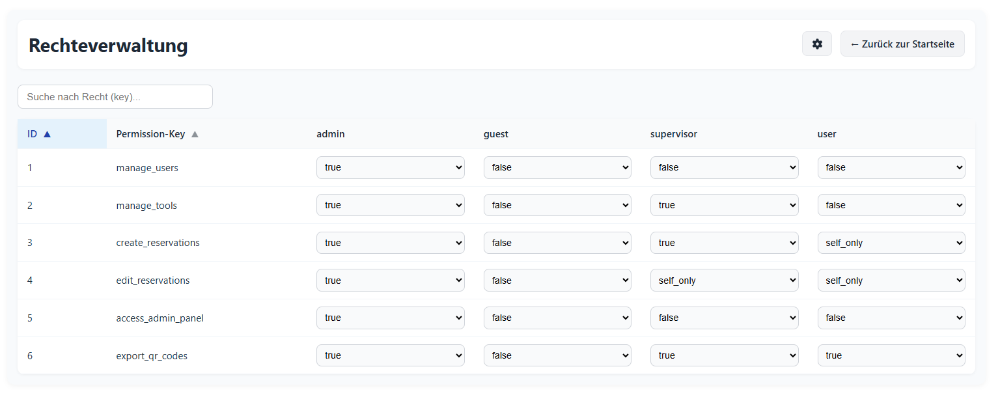
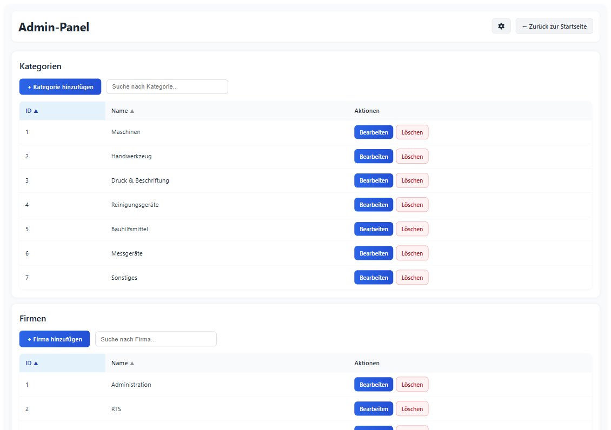
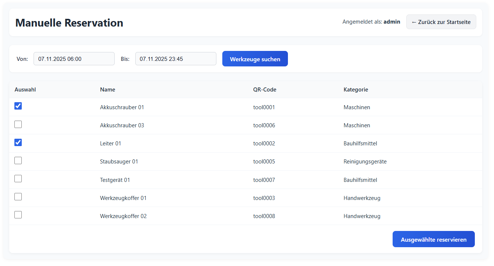

# 📦 Scanventory – Werkzeugreservierung per QR-Code

**Scanventory** ist eine lokal gehostete Webanwendung zur Verwaltung und Ausleihe von Werkzeugen mittels QR-Codes. Sie basiert auf einem **React-Frontend** und einem **Flask-Backend** mit SQLite-Datenbank und ist optimiert für den Einsatz auf Geräten wie dem Raspberry Pi.

---

## 🔍 Projektüberblick

- Offlinefähig, lokal nutzbar (z. B. Raspberry Pi)
- Bedienung per HID-Scanner (Tastaturemulation)
- QR-Code-System für Benutzer, Werkzeuge & Funktionen
- Rollenbasiertes Berechtigungssystem (`admin`, `supervisor`, `user`, `guest`)
- Kalender- und Listenansicht für alle Reservationen
- Adminbereich zur Verwaltung von Benutzern, Werkzeugen & Rechten
- Unterstützung für CSV-Import & QR-Export (PNG/ZIP)
- Unterstützung für manuelle & gescannte Reservationen

---

## 🧱 Projektstruktur

```
scanventory_v2/
├── backend/
│   ├── __pycache__/
│   ├── instance/
│   ├── routes/
│   ├── scheduler/
│   ├── utils/
│   ├── venv/
│   ├── .env
│   ├── app.py
│   ├── models.py
│   ├── requirements.txt
│   └── setup.py
├── frontend/
│   ├── node_modules/
│   ├── public/
│   ├── src/
│   │   ├── components/
│   │   ├── pages/
│   │   ├── styles/
│   │   ├── utils/
│   │   ├── App.css
│   │   ├── App.jsx
│   │   ├── index.css
│   │   └── main.jsx
│   ├── .env
│   ├── index.html
│   ├── package.json
│   ├── package-lock.json
│   ├── vite.config.js
│   └── .gitignore
└── README.md
```

---

## ⚙️ Technologien

| Bereich     | Technologie              |
| ----------- | ------------------------ |
| Frontend    | React + Vite, CSS-Module |
| Backend     | Flask, SQLAlchemy        |
| Auth        | JWT, bcrypt              |
| Datenbank   | SQLite                   |
| QR-Codes    | qrcode, Pillow           |
| Zeitplanung | APScheduler              |

---

## 🖥️ Installation (lokal, z. B. in VS Code)

### 🔹 Voraussetzungen

- Python 3.10+
- Node.js + npm
- Git

### 🔹 Backend einrichten

```bash
git clone https://github.com/outcastoasis/scanventory_v2.git
cd scanventory_v2/backend
python -m venv venv
source venv/bin/activate  # Windows: venv\Scripts\activate
pip install -r requirements.txt
```

.env-Datei erstellen:

```ini
# backend/.env
SECRET_KEY=admin1234

ADMIN_USERNAME=admin
ADMIN_PASSWORD=admin123
ADMIN_QR=usr0001

SUPERVISOR_USERNAME=supervisor
SUPERVISOR_PASSWORD=supervisor123
SUPERVISOR_QR=usr0002

TESTUSER_USERNAME=testuser
TESTUSER_PASSWORD=testuser123
TESTUSER_QR=usr0003
```

Backend starten:

```bash
python app.py
```

### 🔹 Frontend einrichten

```bash
cd ../frontend
npm install
npm run dev
```

`.env` Datei:

```ini
# frontend/.env
VITE_API_URL=http://localhost:5050
```

Frontend erreichbar unter: [http://localhost:5173](http://localhost:5173)

---

## 🍓 Installation auf Raspberry Pi

- Raspberry Pi OS (Bookworm) mit Lite Version

### 1. Pakete installieren

```bash
sudo apt update && sudo apt upgrade -y
sudo apt install git python3 python3-pip python3-venv nginx nodejs npm sqlite3 -y
```

### 2. Projekt klonen

```bash
sudo git clone https://github.com/outcastoasis/scanventory_v2.git
sudo chown -R $USER:$USER scanventory_v2
```

### 3. Backend vorbereiten

```bash
cd scanventory_v2/backend
python3 -m venv venv && source venv/bin/activate
pip install -r requirements.txt
```

### 4. Datenbank initialisieren

```bash
export FLASK_APP=app
flask db init
flask db migrate -m "Initial schema"
flask db upgrade
```

### 5. Benutzer initialisieren

`.env` Datei wie oben beschrieben im `backend/` Ordner anlegen, dann:

```bash
python3 app.py
```

### 6. Gunicorn Service einrichten

```bash
sudo nano /etc/systemd/system/scanventory_v2.service
```

**Inhalt:**

```
[Unit]
Description=Scanventory v2 Flask Backend with Gunicorn
After=network.target

[Service]
User=pi
Group=www-data

WorkingDirectory=/home/pi/scanventory_v2/backend

Environment="PATH=/home/pi/scanventory_v2/backend/venv/bin:/usr/bin:/bin"

ExecStart=/home/pi/scanventory_v2/backend/venv/bin/gunicorn \
    --workers 3 \
    --bind unix:/run/scanventory_v2/scanventory_v2.sock \
    "app:create_app()"

Restart=always

[Install]
WantedBy=multi-user.target

```

Service starten:

```bash
sudo mkdir -p /run/scanventory_v2
sudo chown pi:www-data /run/scanventory_v2
sudo systemctl daemon-reload
sudo systemctl enable scanventory_v2
sudo systemctl start scanventory_v2
sudo systemctl status scanventory_v2
```

### 7. Frontend vorbereiten

```ini
# Datei: frontend/.env
VITE_API_URL=http://localhost:5050
```

```bash
cd ../frontend
npm install
npm run build
```

### 8. Nginx konfigurieren

```bash
sudo nano /etc/nginx/sites-available/scanventory_v2
```

**Inhalt:**

```
server {
    listen 80;
    server_name _;

    # React-Frontend
    root /home/pi/scanventory_v2/frontend/dist;
    index index.html;

    # React Dateirouting
    location / {
        try_files $uri /index.html;
    }

    # API an Gunicorn weiterleiten
    location /api {
        proxy_pass http://unix:/run/scanventory_v2/scanventory_v2.sock;

        proxy_set_header Host $host;
        proxy_set_header X-Real-IP $remote_addr;
    }
}
```

```bash
sudo chmod o+rx /home/pi
sudo ln -s /etc/nginx/sites-available/scanventory_v2 /etc/nginx/sites-enabled/
sudo nginx -t && sudo systemctl restart nginx
```

---

## 📸 Screenshots








---

## 📅 Hauptfunktionen (Auszug)

- Werkzeugausleihe über QR-Codes (usr + tool + dur)
- Rückgabe über QR-Code "return"
- Übersicht aller Reservationen im Kalender (öffentlich)
- Adminpanel für Benutzer/Werkzeug/Rechte
- Rollen- und Rechteverwaltung über die Datenbank
- Login-System mit Token (JWT)
- Filterbare Listen & QR-Export
- Automatische Rückgaben per Scheduler

---

## 💡 Weitere Ideen & geplante Features

- [] aktuell keine weiteren Features geplant

---

## Roadmap für UI-, Frontend- und Backend-Optimierungen

Diese Roadmap bündelt die wichtigsten technischen und UI-bezogenen Verbesserungen für **Scanventory**. Ziel ist es, die Wartbarkeit, Performance, Benutzerfreundlichkeit und Systemsicherheit schrittweise zu erhöhen.

### 1. Quick Wins

Diese Maßnahmen haben einen hohen Nutzen bei vergleichsweise geringem Aufwand:

- **API-Zugriffe zentralisieren**
  - Einen gemeinsamen API-Client für Base-URL, Auth-Header, Fehlerbehandlung und Response-Parsing einführen.
  - Dadurch werden doppelte `fetch`-Logik und inkonsistente Fehlerbehandlung im Frontend reduziert.

- **Navigation ohne Seiten-Reload**
  - `window.location.href` und `window.location.reload()` durch React-Router-Navigation und lokales State-Management ersetzen.
  - Das verbessert die Nutzererfahrung und macht die Anwendung spürbar flüssiger.

- **Einheitliches Feedback-System**
  - `alert()` und `confirm()` durch eigene Dialoge, Toasts oder Statusmeldungen ersetzen.
  - Das wirkt moderner, ist mobilfreundlicher und sorgt für konsistentere UX.

- **API-Konfiguration vereinheitlichen**
  - Die Base-URL-Konfiguration im Frontend konsolidieren, damit Entwicklungs- und Produktionsbetrieb klar getrennt und zuverlässig funktionieren.

- **Seiteneffekte aus Lese-Endpunkten entfernen**
  - Alte Reservationen nicht mehr während `GET /api/reservations` löschen.
  - Cleanup-Prozesse stattdessen über Scheduler oder separate Wartungsroutinen ausführen.

### 2. Mittelfristige Verbesserungen

Diese Punkte verbessern die interne Architektur und schaffen eine stabilere Basis für weitere Features:

- **Große Frontend-Seiten zerlegen**
  - Besonders `Home.jsx` sollte in kleinere Hooks und Komponenten aufgeteilt werden.
  - Vorschläge:
    - `useAuthSession`
    - `useScannerFlow`
    - `useReservations`
    - `ScanStatusPanel`
    - `DurationModal`
    - `UserMenu`

- **Scanner-Workflow robuster machen**
  - Scanner-Eingaben nur verarbeiten, wenn kein Formularfeld fokussiert ist.
  - Zusätzlich einen sichtbaren Scanner-Status anzeigen, damit Nutzer jederzeit wissen, ob Scan-Eingaben aktiv angenommen werden.

- **Spezialisierte Reservation-Endpunkte einführen**
  - Zusätzliche API-Routen wie:
    - `/api/reservations/today`
    - `/api/reservations/active`
    - `/api/reservations/upcoming`
  - Dadurch wird das Frontend einfacher, schneller und zielgerichteter.

- **`is_borrowed` vereinfachen**
  - Den Status nicht an vielen Stellen gleichzeitig pflegen.
  - Entweder dynamisch aus aktiven Reservationen ableiten oder nur noch an einer klar definierten zentralen Stelle aktualisieren.

- **Logging-System verbessern**
  - Laufzeit-Logs und Audit-Logs stärker trennen.
  - Direkte Datenbank-Commits bei jedem Logeintrag vermeiden.

### 3. Systemische und langfristige Optimierungen

Diese Maßnahmen erhöhen Sicherheit, Datenqualität und Zukunftsfähigkeit:

- **Authentifizierung härten**
  - `SECRET_KEY` ohne Fallback erzwingen.
  - CORS enger konfigurieren.
  - Mittelfristig prüfen, ob HttpOnly-Cookies oder ein robusteres Session-Konzept sinnvoll sind.

- **Unbekannte QR-Codes kontrolliert behandeln**
  - Unbekannte Benutzer- oder Werkzeug-QRs nicht automatisch sofort als neue Datensätze anlegen.
  - Stattdessen besser einen kontrollierten Import- oder Prüfprozess einführen.

- **Datenbank-Performance verbessern**
  - Indizes für häufige Reservation-Abfragen ergänzen, insbesondere auf:
    - `tool_id`
    - `start_time`
    - `end_time`

- **Tests aufbauen**
  - Backend:
    - Rechteprüfung
    - Konfliktprüfung bei Reservationen
    - Rückgabe-Logik
    - QR-Flow
  - Frontend:
    - Scanner-Workflow
    - Kalenderdarstellung
    - Login-/Session-Verhalten

### Empfohlene Umsetzungsreihenfolge

1. API-Client vereinheitlichen
2. Navigation ohne Reload umbauen
3. `Home.jsx` in Hooks und Teilkomponenten zerlegen
4. Reservation-API aufräumen und spezialisieren
5. `is_borrowed`-Logik vereinfachen
6. Auth, Logging und Tests härten

### Erwarteter Nutzen

Durch diese Optimierungen gewinnt das Projekt in mehreren Bereichen:

- bessere Wartbarkeit im Frontend und Backend
- klarere Datenflüsse und weniger Seiteneffekte
- höhere Performance auf schwächerer Hardware wie Raspberry Pi
- konsistentere und modernere Benutzerführung
- bessere Grundlage für zukünftige Erweiterungen

---

## 📄 Lizenz

MIT – freie Nutzung für Bildung & interne Zwecke.
